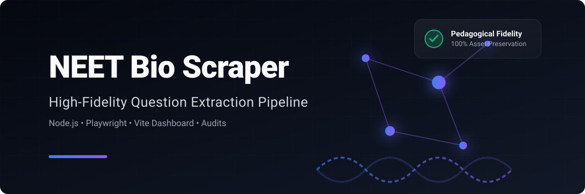
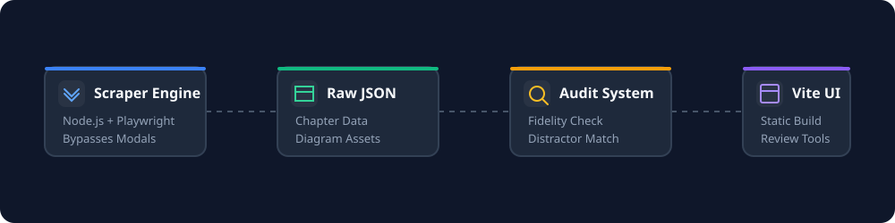

<div align="center">
  

  <br />

  <p>
    <b>High-Fidelity Previous Year Question Scraper & Dashboard</b>
  </p>

  <p>
    
    
    
    
  </p>
</div>

<br />

A robust, enterprise-grade Node.js scraper tailored for EduRev's NEET biology previous-year-question (PYQ) pages. Built with precision to ensure **100% pedagogical fidelity**.

---

## ✨ Features

- **Robust Extraction**: Scrapes question text, answer choices, exact correct answer keys, and rich explanation text.
- **Asset Preservation**: Automatically downloads and maps table grids and diagram/image assets perfectly.
- **Modal Bypassing**: Defeats anti-scraping overlays intelligently.
- **Audit Engine**: Runs benchmark audits to detect option anomalies or distractor-matching failures.
- **Static UI Dashboard**: Ships with a built-in static Vite dashboard for reviewing JSON data visually.

---

## 🏗️ Architecture Pipeline

<div align="center">
  
</div>

<br />

<details>
<summary><b>Click to expand detailed repository layout</b></summary>
<br />

- `scraper/` — Chapter discovery, PYQ discovery, and scraping entry points.
- `audit/` — Scoring, alignment, and report generation.
- `dashboard/` — Static dashboard and generated data builder.
- `fixtures/` — Bundled HTML fixtures for local testing.
- `docs/` — Publishing and architecture notes.
- `data/` — Generated raw JSON data and assets.

</details>

---

## 🚀 Quick Start

Get the scraper and dashboard up and running in minutes.

```bash
# 1. Install dependencies
npm install

# 2. Run the scraping pipeline
npm run scrape:chapters
npm run scrape:pyq-links
npm run scrape:multi

# 3. Verify data integrity
npm run audit

# 4. View results in the UI
npm run dashboard:build
npm run dashboard:serve
```

> **Note**: Open the dashboard at `http://localhost:4173/dashboard/` after running the serve command.

---

## 📦 Canonical Scripts

The repository ships with an array of scripts tailored for the entire data lifecycle.

| Command | Description |
|---|---|
| `npm run scrape:chapters` | Discover the full Biology course chapter list. |
| `npm run scrape:pyq-links` | Discover chapter-level NEET PYQ links. |
| `npm run scrape` | Scrape the benchmark fixture using the standalone engine. |
| `npm run scrape:single` | Scrape a single PYQ page directly. |
| `npm run scrape:multi` | Scrape all verified chapter PYQ pages. |
| `npm run audit` | Run benchmark audits and regenerate anomaly reports. |
| `npm run audit:options` | Scan option anomalies exclusively. |
| `npm run dashboard:build` | Rebuild static dashboard data snapshots. |
| `npm run dashboard:serve` | Serve the repository for local dashboard browsing. |

---

## 📚 Recommended Workflow

1. **Discover** the current Biology chapter list.
2. **Refresh** the chapter PYQ link mapping.
3. **Regenerate** chapter JSON and assets.
4. **Run** the audit to ensure total data fidelity.
5. **Rebuild** dashboard data.
6. **Spot-check** the latest chapters via the visual dashboard.

See [docs/publishing.md](docs/publishing.md) for the complete publishing checklist.

---

## 🗂️ Generated Outputs

The pipeline generates highly structured deterministic outputs:

- `data/raw/chapter-links.json` — Ordered chapter inventory discovered from the course page.
- `data/raw/pyq-links.json` — Chapter-to-PYQ mapping for verified NEET pages.
- `data/raw/BIOLOGY/chapters/<chapter-slug>.json` — Scraped question data.
- `data/assets/BIOLOGY/chapters/<chapter-slug>/` — Downloaded question visual assets.
- `audit/reports/` — Benchmark and alignment reports.
- `dashboard/data/` — Browser-ready static snapshots.

> **Maintenance Note**: The repository purposefully keeps generated chapter data and assets committed because the dashboard reads them directly. Scratch and backup material stay outside the public workflow.
---

## 🤝 Contributors

<a href="https://github.com/yutuknown/neet-bio-scrapper/graphs/contributors">
  
</a>
