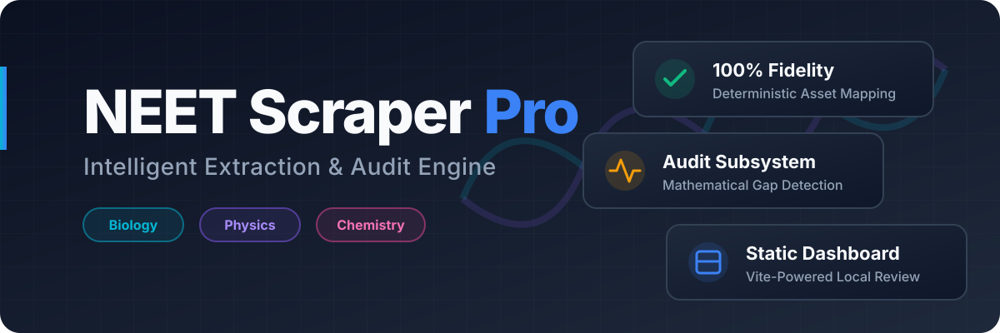

<div align="center">
  
  <br />
  <p><b>NEET Question Intelligence Pipeline, Audit Engine, and Static Dashboard</b></p>
  <p>
    
    
    
    
    
  </p>
</div>

<br/>

A **production-grade scraper pipeline** designed to accurately extract, audit, and visualize NEET Previous Year Questions (PYQs) from EduRev across **Biology, Physics, and Chemistry**. It produces highly deterministic JSON outputs, perfectly maps diagrammatic assets, mathematically audits for structural anomalies, and ships a static review dashboard.

---

## 🏗️ Architecture & Flow

The system is decoupled into four primary layers, running independently for maximum resilience:

<div align="center">
  
</div>

<br/>

### Data Pipeline Lifecycle

<div align="center">
  
</div>

<br/>

---

## ✨ Key Features

| Feature | Description |
| :--- | :--- |
| **🌐 Multi-Subject Support** | Dynamic routers for `Biology`, `Physics`, and `Chemistry` across Class 11 and 12. |
| **🧠 Intelligent Parsing** | Uses Cheerio to bypass obfuscated HTML structures and preserve critical pedagogic tables & LaTeX. |
| **📊 Deterministic Assets** | Downloads and correctly assigns image markers (`[IMAGE_1]`) strictly to the appropriate question or explanation block. |
| **🛡️ Anomaly Engine** | Python subsystems mathematically audit outputs, finding distractor overlaps and schema gaps. |
| **📈 Local Review UI** | A static Vite dashboard automatically binds to audit outputs, offering instant QA tooling. |

---

## 📂 Repository Layout

- `scraper/` — Core extraction logic, subject controllers, and specific runners (`run-biology.js`, etc.).
- `audit/` — Python pipeline for schema validation, chapter scoring, and anomaly scanning.
- `dashboard/` — The Vite static app and data build scripts (`build-data.js`).
- `data/` — Holds the generated raw chapter `.json` files and all downloaded assets.
- `docs/` — Core architectural designs and publishing guides.

---

## 🚀 Quick Start

### 1. Installation

```bash
# Install Node dependencies
npm install

# (Ensure Python 3 is installed for the audit tools)
```

### 2. Extract Data

<details>
<summary><b>Click to expand Scraper Commands</b></summary>

```bash
# 🎯 Scrape everything
npm run scrape:all

# 🧬 Scrape Biology only
npm run scrape:bio

# ⚛️ Scrape Physics only
npm run scrape:physics

# 🧪 Scrape Chemistry only
npm run scrape:chemistry

# 🔬 Scrape a single target PYQ (for debugging)
npm run scrape:single -- --pyq <URL>
```
</details>

### 3. Audit & Score

<details>
<summary><b>Click to expand Audit Commands</b></summary>

```bash
# Run the primary audit (Biology default)
npm run audit

# Run a custom subject audit (e.g. Physics & Chemistry)
python3 audit/run_subject_audit.py --subjects physics,chemistry --report-subdir physics-chem-baseline

# Scan for extraction anomalies specifically
npm run audit:options
```
</details>

### 4. Build & Serve UI

```bash
# Build static dashboard JSONs from audit reports
npm run dashboard:build

# Serve the static Vite interface
npm run dashboard:serve
```

👉 **Dashboard URL:** `http://localhost:4173/dashboard/`

---

## 🛡️ Audit Scoring Engine

The audit subsystem evaluates structural and semantic accuracy. Risk bands (`High`, `Medium`, `Low`) are mathematically determined in `audit/score_chapter.py`:

- **Structural Accuracy**: Ensures perfect JSON schema validation.
- **Completeness**: Compares expected expected marker counts from source HTML to what was structurally extracted.
- **Semantic Accuracy**: Calculates block alignment between original text chunks and the segmented JSON arrays.
- **Anomaly Score**: A blended penalty applying weights to Schema Gaps (`40%`), Empty Explanations (`25%`), Duplicate Options (`20%`), and High Image Densities (`15%`).

For a deep dive, see [docs/architecture.md](docs/architecture.md).

---

## 👥 Contributors

<div align="center">
  <a href="https://github.com/yutuknown/neet-bio-scrapper/graphs/contributors">
    
  </a>
</div>
