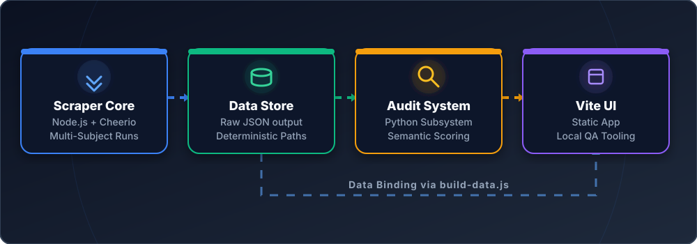
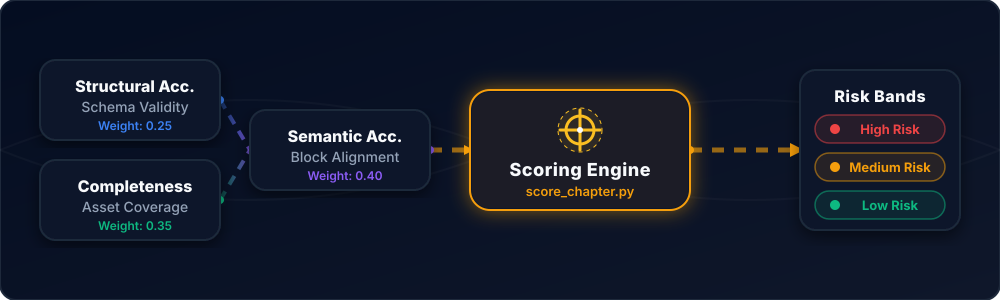

# Repository architecture

  

 

## Runtime layers

- `scraper/index.js` — top-level CLI entrypoint.
- `scraper/runners/` — subject and bundle runners (`run-biology.js`, `run-physics.js`, `run-chemistry.js`, `run-all.js`).
- `scraper/subjects/<subject>/` — subject wrappers and controllers.
- `scraper/core/` — shared discovery and extraction modules:
  - `scraper.js` — shared extraction engine.
  - `course-chapter-links.js` — chapter list discovery.
  - `pyq-links.js` — chapter-to-PYQ discovery + verification.
  - `multi-chapter-scraper.js` — batch orchestration over discovered PYQ links.
  - `browser.js`, `config.js`, `paths.js`, `utils.js` — shared utilities and config.

## Audit subsystem

  

 

- `audit/run_audit.py` — Biology audit pipeline.
- `audit/run_subject_audit.py` — subject/class-filtered audit pipeline.
- `audit/score_chapter.py` — chapter scoring model.
- `audit/schema.py` — schema validation.
- `audit/align_questions.py` — source-to-scraped semantic alignment.
- `audit/detect_schema_gaps.py` — missing/residual gap risk.
- `audit/scan_option_anomalies.py` — option anomaly reporting.
- `audit/scan_explanation_accuracy.py` — explanation distraction / accuracy reporting.
- `audit/build_reports.py` — report emission (`csv` + `json`).
- `audit/biology_sources.py`, `audit/subject_sources.py` — source mapping configurations.
- `audit/extract_source_signals.py` — extracts expected marker counts from HTML.

## Dashboard subsystem

- `dashboard/build-data.js` — generates dashboard snapshots from raw data + reports.
- `dashboard/app.js` — static dashboard app.
- `dashboard/data/` — generated browser-ready data.

## Generated data layout

- `data/raw/BIOLOGY/B11|B12/chapters/*.json`
- `data/raw/PHYSICS/P11|P12/chapters/*.json`
- `data/raw/CHEMISTRY/C11|C12/chapters/*.json`
- `data/assets/<SUBJECT>/<CLASS>/chapters/<chapter-slug>/...`
- `audit/reports/` and `audit/reports/<report-subdir>/`

## Internal workspace directories

- `.backup/` — historical backups/reference snapshots.
- `.debug/` — temporary diagnostics and local investigation artifacts.
- `node_modules/` — installed dependencies.

## Naming policy

- JS modules use `kebab-case`.
- Python modules use `snake_case`.
- Audit report JSON files use `snake_case`.
