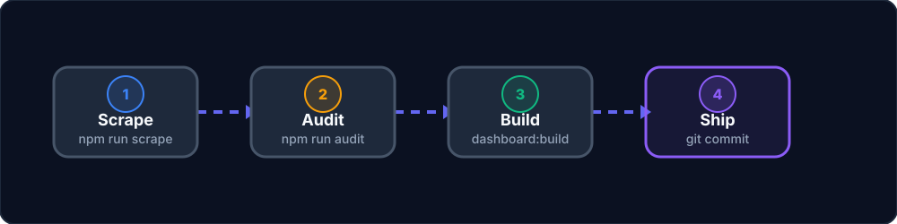

# Publishing checklist

  

 

Use this checklist before shipping a repository snapshot to GitHub.

## 1) Refresh scraper outputs

Choose the appropriate scope:

- Full pipeline: `npm run scrape:all`
- Biology only: `npm run scrape:bio`
- Physics only: `npm run scrape:physics`
- Chemistry only: `npm run scrape:chemistry`
- Targeted single PYQ: `npm run scrape:single -- <pyq-url>`

## 2) Regenerate audit reports

- Biology baseline audit:
  - `npm run audit`
- Subject-filtered audit (example):
  - `python3 audit/run_subject_audit.py --subjects physics,chemistry --report-subdir physics-chem-baseline`

Optional targeted scan:

- `npm run audit:options`

## 3) Rebuild dashboard snapshots

- `npm run dashboard:build`

## 4) Visual verification

- `npm run dashboard:serve`
- Open `http://localhost:4173/dashboard/`
- Spot-check representative chapters across Biology/Physics/Chemistry.

## 5) Release gate checks

- `git status` contains only intentional changes.
- No stale temporary files are included.
- `audit/reports/` and `dashboard/data/` are in sync with latest scrape/audit run.

## 6) Audit score interpretation (quick reference)

Scoring is defined in `audit/score_chapter.py`.

- `final_accuracy = 0.25*structural + 0.35*completeness + 0.4*semantic`
- `schema_gap_risk = 0.7*missing_question_ratio + 0.3*residual_block_ratio` (capped at `1.0`)
- `anomaly_score` blends schema-gap risk, empty explanations, duplicate options, and high image density.

Risk bands:

- `high`: anomaly `>= 0.6` or schema-gap risk `>= 0.5`
- `medium`: anomaly `>= 0.3` or final accuracy `< 0.75`
- `low`: otherwise

Primary reports to review:

- `chapter_summary.json` / `chapter_summary.csv`
- `schema_failures.json`
- `residual_text_report.json`
- `question_alignment.json`
- `option_anomalies.json`
- `explanation_accuracy_scan.json`
- `high_risk_chapters.json`
- `uncovered_chapters.json`

## 7) Keep internal-only artifacts out of release workflow

- `.backup/` and `.debug/` are local/internal reference areas.
- Do not rely on them as canonical project surfaces.
